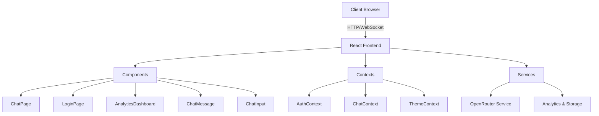
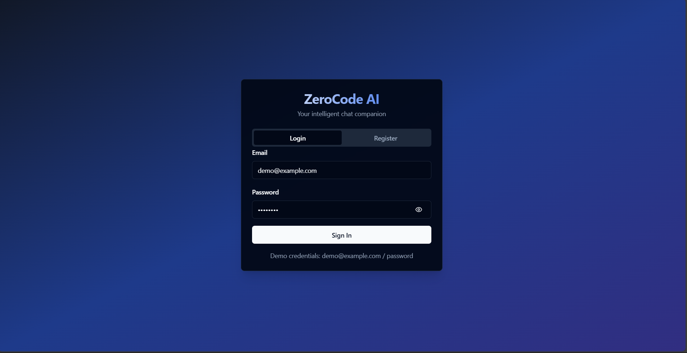
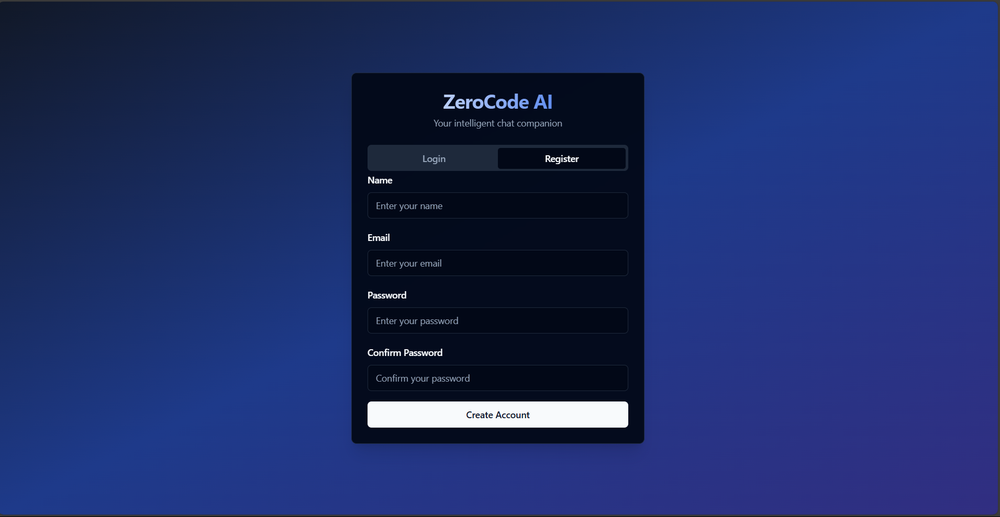
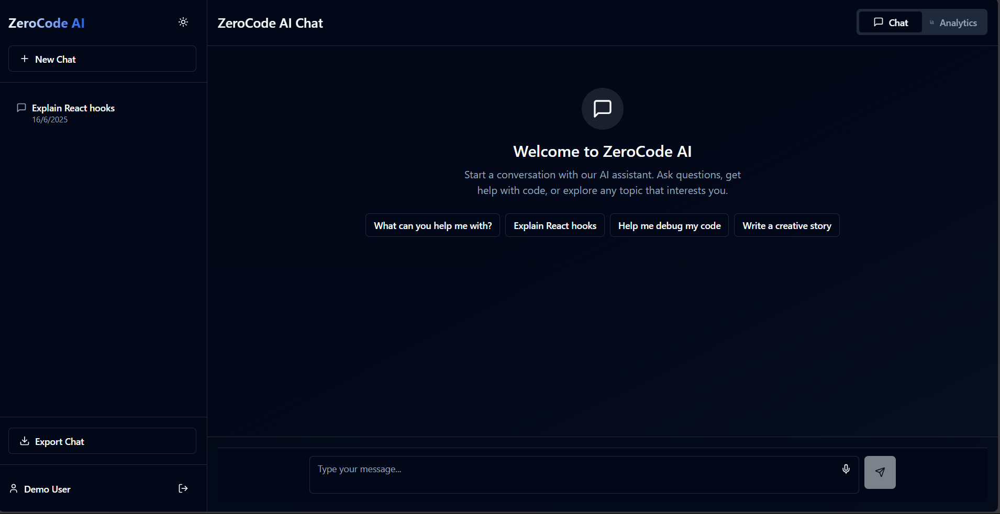
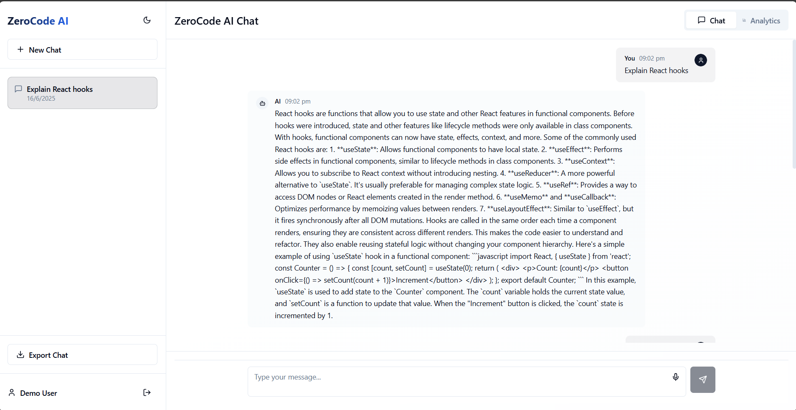
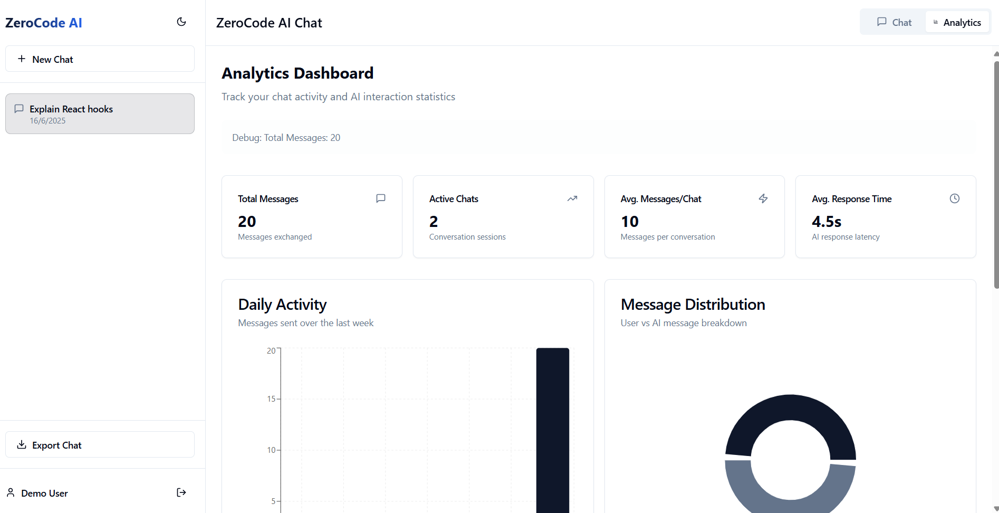
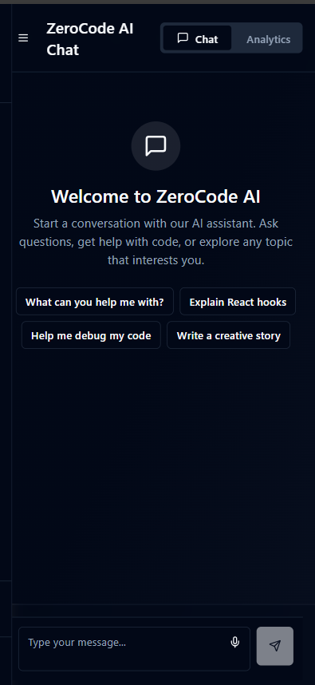
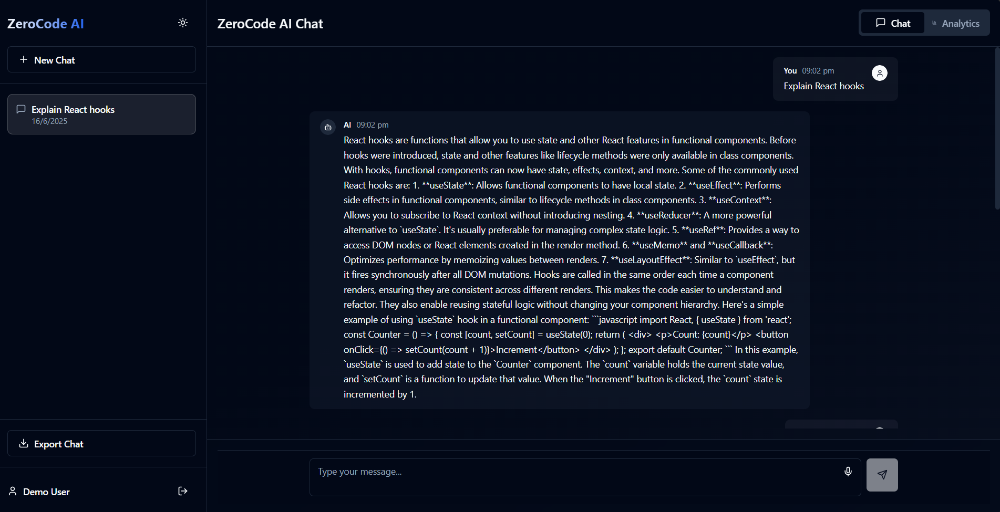

# ZeroCode AI Chat Hub 🤖

A modern, feature-rich AI chat application built with React, TypeScript, and Tailwind CSS. Powered by OpenRouter AI for intelligent conversations.

## 🌐 Live Demo

Try out the application: [ZeroCode AI Chat Hub](https://zerocode-fe.netlify.app/)

### Demo Credentials
```
Email: demo@example.com
Password: password
```


## ✨ Features

- 🎯 Multi-model AI chat support (GPT-3.5, Claude-3)
- 🎨 Modern, responsive UI with dark mode
- 📊 Real-time analytics dashboard
- 🔐 User authentication system
- 💾 Chat history persistence
- 📱 Mobile-friendly design
- 🌈 Beautiful UI components with shadcn/ui
- 🔄 Real-time message streaming
- 📈 Usage statistics and analytics

## 🏗️ Architecture

The application follows a clean, modular architecture:



## 🚀 Quick Start

### Prerequisites

- Node.js 18+ installed
- npm or yarn package manager
- OpenRouter API key

### Installation

1. Clone the repository:
   ```bash
   git clone https://github.com/yourusername/fluent-ai-chat-hub.git
   cd fluent-ai-chat-hub
   ```

2. Install dependencies:
   ```bash
   npm install
   # or
   yarn install
   ```

3. Create a `.env` file in the root directory:
   ```env
   VITE_OPENROUTER_API_KEY=your_api_key_here
   ```

4. Start the development server:
   ```bash
   npm run dev
   # or
   yarn dev
   ```

5. Open [http://localhost:5173](http://localhost:5173) in your browser

## 🛠️ Tech Stack

- **Frontend Framework**: React 18 with TypeScript
- **Styling**: Tailwind CSS + shadcn/ui
- **State Management**: React Context
- **AI Integration**: OpenRouter API
- **Build Tool**: Vite
- **Animation**: Framer Motion
- **Charts**: Recharts
- **Form Handling**: React Hook Form + Zod
- **Icons**: Lucide React

## 📁 Project Structure

```
src/
├── components/        # Reusable UI components
├── contexts/         # React Context providers
├── hooks/           # Custom React hooks
├── lib/             # Utility functions
├── pages/           # Page components
├── services/        # API and service integrations
├── styles/          # Global styles and Tailwind config
└── types/           # TypeScript type definitions
```

## 🎯 Key Features Explained

### Authentication
- Email/password authentication
- Protected routes
- Session management

### Chat Interface
- Real-time message streaming
- Code syntax highlighting
- Message history
- Model switching
- Markdown support

### Analytics Dashboard
- Message statistics
- Usage patterns
- Response times
- Interactive charts

## 🎨 UI Components

The application uses a custom design system built with Tailwind CSS and shadcn/ui:

- Custom color system
- Dark/light theme support
- Responsive layouts
- Accessible components
- Modern animations

## 📱 Mobile Support

The application is fully responsive and works great on mobile devices:

- Responsive layout
- Touch-friendly interface
- Mobile-optimized chat view
- Swipe gestures

## 🔐 Security Features

- Secure authentication
- API key protection
- XSS prevention
- Input sanitization

## 🤝 Contributing

Contributions are welcome! Please read our [Contributing Guide](CONTRIBUTING.md) for details on our code of conduct and the process for submitting pull requests.

## 📄 License

This project is licensed under the MIT License - see the [LICENSE](LICENSE) file for details.

## 🙏 Acknowledgments

- [OpenRouter](https://openrouter.ai/) for AI model access
- [shadcn/ui](https://ui.shadcn.com/) for beautiful UI components
- [Tailwind CSS](https://tailwindcss.com/) for styling
- [Vite](https://vitejs.dev/) for the build system

## 📸 Screenshots

### Login page



### Register page



### main page


### Chat Interface


### Analytics Dashboard


### Mobile View


### Dark Mode


### demo

