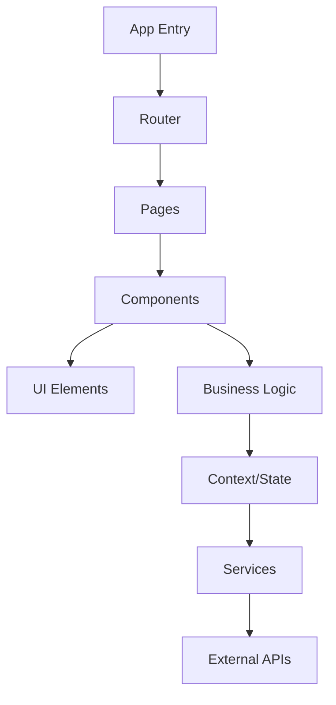
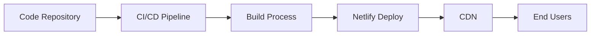

# ZeroCode AI Chat Hub - Technical Design Document

## System Architecture

### Overview
ZeroCode AI Chat Hub is built as a modern single-page application (SPA) using React and TypeScript. The application integrates with OpenRouter.ai to provide access to multiple AI models while maintaining a unified API interface.

### Core Components

#### 1. Frontend Architecture


#### 2. State Management
- **ChatContext**: Manages chat state and history
- **AuthContext**: Handles user authentication
- **ThemeContext**: Controls UI theme preferences

### Data Flow

1. **User Input Processing**
   ```mermaid
   sequenceDiagram
       User->>ChatInput: Enters message
       ChatInput->>ChatContext: Processes input
       ChatContext->>AIService: Sends to API
       AIService->>OpenRouter: Makes API call
       OpenRouter->>AIService: Returns response
       AIService->>ChatContext: Updates state
       ChatContext->>UI: Renders response
   ```

2. **Analytics Processing**
   ```mermaid
   sequenceDiagram
       ChatContext->>AnalyticsEngine: Sends event
       AnalyticsEngine->>Storage: Processes data
       Storage->>Dashboard: Updates metrics
   ```

## Implementation Details

### 1. AI Model Integration

#### Model Selection Logic
```typescript
const modelSelection = {
  default: 'openai/gpt-3.5-turbo',
  advanced: 'anthropic/claude-3-opus',
  balanced: 'anthropic/claude-3-sonnet'
};

const selectModel = (message: string, context: ChatContext) => {
  if (isComplexQuery(message)) return modelSelection.advanced;
  if (isBalancedQuery(message)) return modelSelection.balanced;
  return modelSelection.default;
};
```

#### Response Processing
```typescript
const processResponse = async (response: AIResponse) => {
  // Validation
  if (!response.content) throw new Error('Invalid response');
  
  // Formatting
  const formattedResponse = {
    id: generateId(),
    content: response.content,
    timestamp: Date.now(),
    metadata: extractMetadata(response)
  };
  
  return formattedResponse;
};
```

### 2. Analytics Implementation

#### Metrics Collection
```typescript
interface MetricEvent {
  type: 'message' | 'response' | 'error';
  timestamp: number;
  duration?: number;
  metadata: Record<string, any>;
}

const collectMetrics = (event: MetricEvent) => {
  // Process event
  // Update analytics state
  // Trigger UI updates
};
```

#### Performance Monitoring
- Response time tracking
- Error rate monitoring
- Model performance comparison

### 3. Security Considerations

1. **Authentication**
   - JWT-based auth flow
   - Token refresh mechanism
   - Secure storage practices

2. **Data Protection**
   - Message encryption
   - Secure API key handling
   - Rate limiting implementation

## Testing Strategy

### 1. Unit Tests
```typescript
describe('Chat Service', () => {
  it('should process messages correctly', () => {
    // Test implementation
  });
  
  it('should handle errors gracefully', () => {
    // Test implementation
  });
});
```

### 2. Integration Tests
- API integration testing
- State management testing
- Component interaction testing

### 3. End-to-End Tests
- User flow testing
- Performance testing
- Cross-browser compatibility

## Deployment Architecture

### Production Setup


### Performance Optimization
1. Code splitting
2. Lazy loading
3. Caching strategies
4. Asset optimization

## Future Enhancements

1. **Planned Features**
   - Multi-language support
   - Advanced analytics
   - Custom model fine-tuning

2. **Technical Improvements**
   - WebSocket integration
   - Progressive Web App
   - Offline support

## Appendix

### A. API Documentation
Detailed API endpoints and usage examples

### B. Component Library
Reusable component documentation

### C. State Management Patterns
Best practices and implementation details 